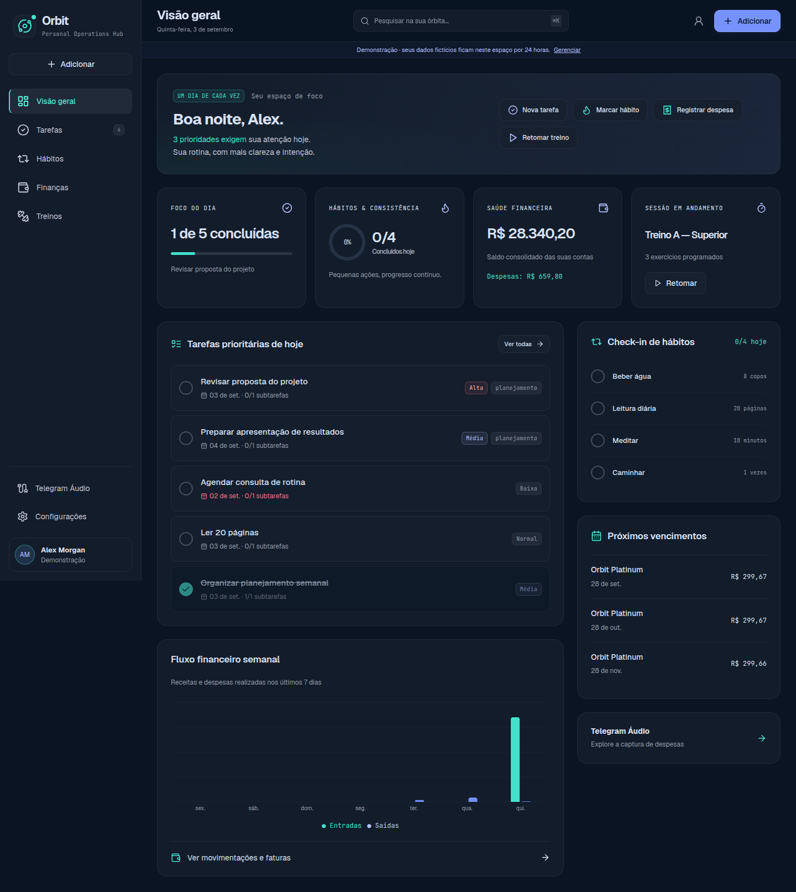
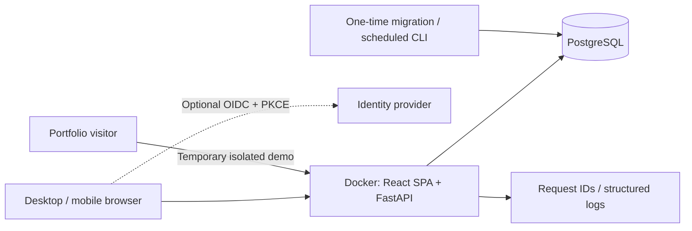

# Orbit · Personal Operations Hub

A personal workspace for tasks, habits, finances and workouts. Built for everyday desktop and mobile use, with an isolated, interactive portfolio demo.

**One application, one URL, one database:** personal accounts and temporary visitor demos share the Docker application and PostgreSQL, with data isolated by owner. Public hosting is prepared, but no public URL has been provisioned yet. See [deployment](infra/render/README.md).



## Run with Docker

Requires Docker Engine with the Compose plugin. No paid account, AI key, Node or Python installation is needed for the core demo.

```sh
cp .env.example .env
docker compose up -d --build --wait
```

Open **http://localhost:8080** and select **Experimentar demonstração**. Each visitor receives an expiring, isolated workspace with fictitious data. Your changes persist in PostgreSQL across page reloads and container restarts until the demo expires. Personal accounts have no demo expiry. Create yours manually:

```sh
docker compose exec app python -m app.accounts create YOUR_EMAIL
```

Then sign in with your email/password on the same page. There is no public registration or user CRUD. The optional `/demo` path opens the public entry even in a browser with a personal session.

```sh
docker compose logs -f app
docker compose stop
# Start again without removing the database volume:
docker compose up -d --wait
```

Do not use `docker compose down -v` on data you want to keep. For real data, create your account and set up backups first. New deployments default to `APP_MODE=combined`; explicit `personal` and `demo` modes remain supported.

## Explore in five minutes

1. Create a task with a due date, checklist and tags. Complete it and reload the page.
2. Record a habit check-in, inspect the calendar and adjust its quantity.
3. Add an expense or installment purchase. Inspect the invoice and register a partial payment.
4. Resume the seeded workout, enter a completed set and finish the session. Review the historical snapshot.
5. Open settings to change timezone, weight unit or reset **only your demo workspace**.

## Implemented core

- Built-in email/password login with scrypt, HttpOnly sessions, CSRF protection and persistent login limits. Operator-only account creation and recovery; optional OIDC PKCE for existing providers. Demo bearer tokens take precedence over personal cookies and never fall back to personal data when expired.
- Task lists, statuses, deadlines, priorities, tags, checklists, archival/restoration, filtering and version-conflict protection.
- Habit schedules, quantity check-ins, local dates, calendar, adherence and streaks with future-effective schedule and target edits.
- Integer-money accounts, categories, cash transactions, planned transactions, atomic transfers and idempotent daily/weekly/monthly/yearly recurring occurrences with automatic initial horizons.
- Credit cards, exact installment allocation, closing/due-date cycles, invoices, open-cycle purchase editing, partial payments, cancellations and auditable refunds/credit carry-forward.
- Workout routines, exercise library, independent session snapshots, sets with optional RPE/RIR, draft preservation, timer, history, volume and personal-record calculations.
- Responsive dashboard with real account data, quick actions, empty/error/loading states, keyboard-accessible drawers and mobile navigation.

The optional Telegram adapter includes linking, durable inbox/outbox, provider boundaries and an explicitly labeled fixture simulation. **Full live audio/conversation/receipt flow is not a validated release feature**; see [backend limitations](backend/README.md). No AI provider is required to run the core.

## Technical choices

| Area | Implementation |
|---|---|
| API | Python 3.14 runtime, FastAPI/Pydantic, SQLAlchemy 2, psycopg 3, Alembic |
| Data | PostgreSQL 18; typed relational tables, owner-aware foreign keys, integer money, local DATE and UTC instants |
| Web | React 19, TypeScript, Vite, TanStack Query, Radix dialogs, Recharts; generated OpenAPI DTOs |
| Identity | Built-in email/password and revocable sessions; optional OIDC/Keycloak |
| Delivery | One non-root multi-stage Docker image with same-origin SPA/API; Compose migration job, persistent DB volume |
| Quality | Real PostgreSQL integration tests, critical domain tests, Vitest and Playwright desktop/mobile journeys |
| Operations | Readiness/liveness, structured request logs and request IDs, backups and isolated restoration script |
| Cloud | One free-plan Render Blueprint service with external PostgreSQL; optional Terraform EC2/SSM lab |

This is a modular monolith. No microservices, Kubernetes, permanent worker or paid observability stack is required for the core.



## Personal mode and online hosting

Personal login setup, optional OIDC testing and free online hosting are documented in [the runbook](docs/runbook.md) and [Render deployment guide](infra/render/README.md). GitHub, Render and Neon are sufficient; Auth0 is not required. No cloud accounts or paid resources are created by `docker compose up`.

Free services can sleep and have shared quotas. The deployment guide uses one service and one database; no always-on guarantee is assumed.

## Development and validation

```sh
cd backend
uv sync --frozen
# DATABASE_URL must point to a disposable PostgreSQL test database.
APP_MODE=demo uv run alembic upgrade head
APP_MODE=demo uv run pytest -q
uv run ruff check app tests
uv run mypy app
cd ../web
npm ci
npm test
npm run build
# Provision browser@example.com in a DISPOSABLE combined test installation first.
# Password: Orbit browser test password 2026 (fictitious CI account only).
ORBIT_BASE_URL=http://127.0.0.1:8080 npm run e2e
```

`backend/tests/test_api.py` defaults to an isolated test server on localhost:55432. Never point tests at your personal database. Tests create only fictitious tenants.

- API documentation: `/api/docs`; schema: `/api/v1/openapi.json`.
- Regenerate checked-in types: `./scripts/generate-api.sh` after installing backend/web development dependencies.
- [HTTP contracts](backend/API.md), [architecture](docs/architecture.md), [validation evidence](docs/validation.md).
- [Approved visual references](docs/design/LEIA-ME.md), [design deviations](docs/design-deviations.md), [product decisions](docs/decisions/001-product-rulings.md).
- [Optional AWS laboratory](infra/aws/README.md). Terraform validation is not a claim of a deployed AWS environment.

The workflow verifies code, contracts and a real container journey. Render can build the Dockerfile directly from this repository without waiting for GitHub Actions or creating a release. The optional GitHub release workflow still publishes a versioned container to GHCR; it does not provision cloud services or migrate databases automatically.
